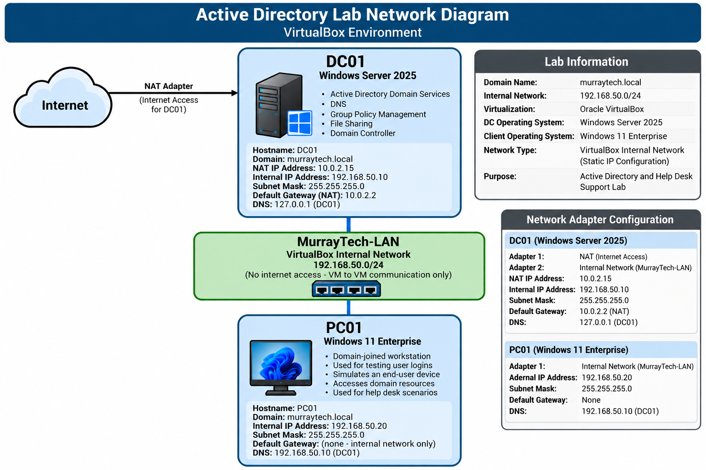
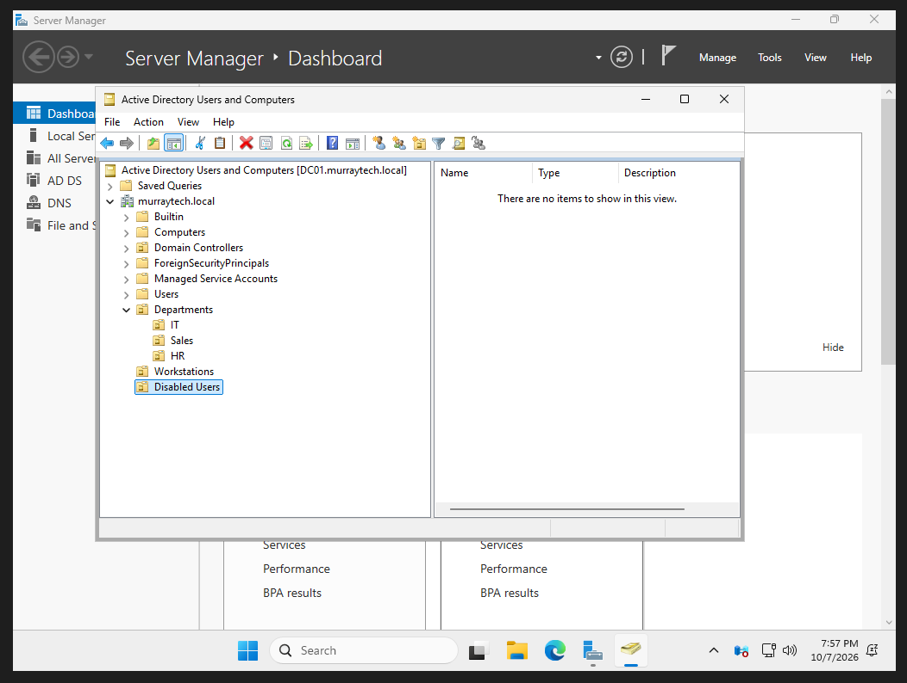
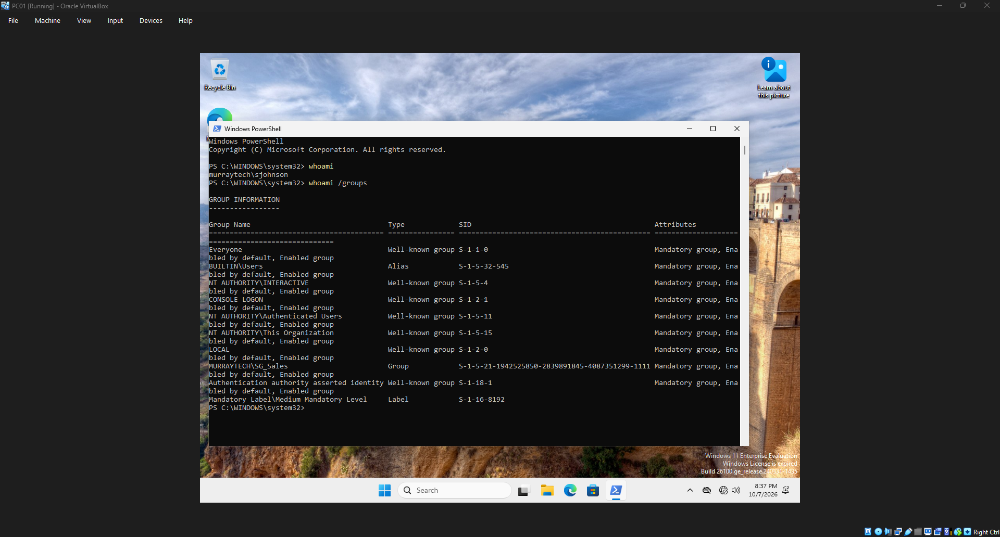
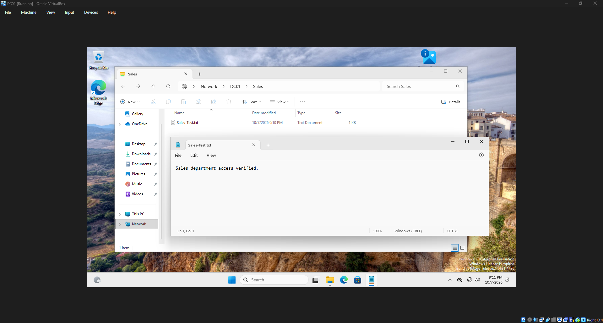
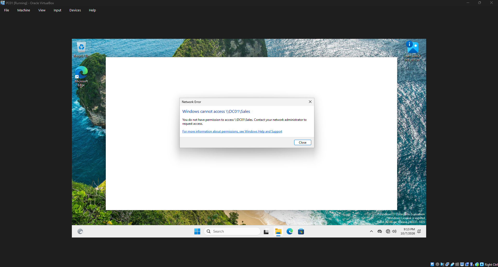
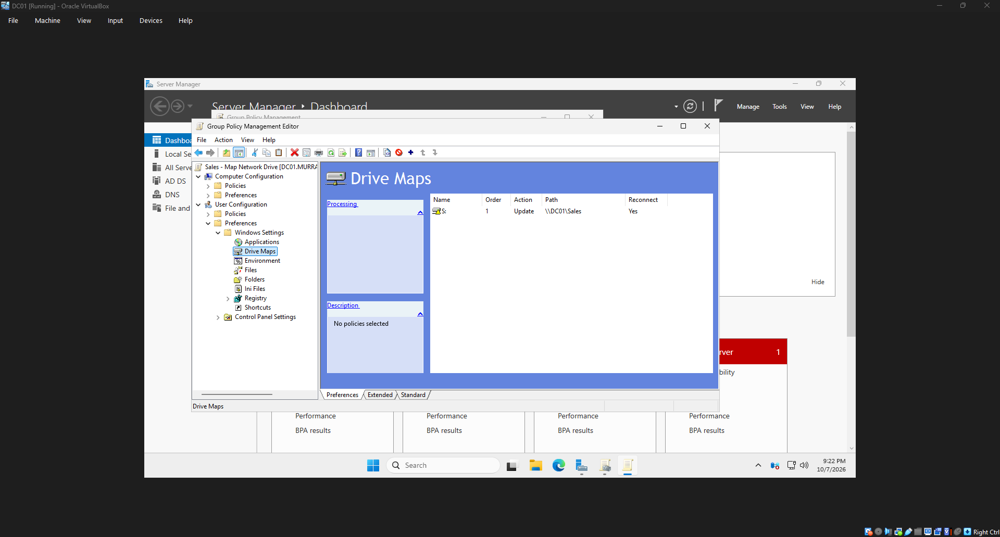
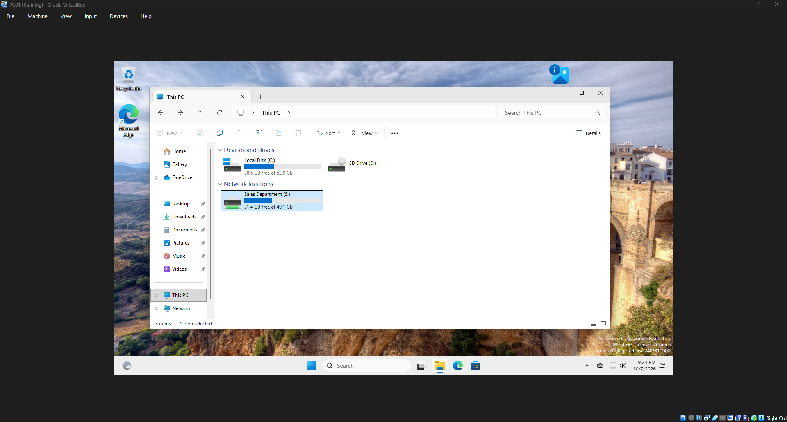

# Active Directory & IT Support Home Lab

A hands-on IT support project demonstrating Windows Server administration, Active Directory management, networking, troubleshooting, and common help desk responsibilities in a simulated business environment.

## Project Overview

I built a virtual IT environment for a fictional company called **Murray Technologies** to gain practical experience with the technologies and tasks commonly used by IT support teams.

Using Oracle VirtualBox, I configured a Windows Server 2025 domain controller and a Windows 11 Enterprise workstation. I then used the environment to practice managing employee accounts, troubleshooting login issues, configuring security permissions, and deploying Group Policy settings.

The project includes four documented help desk tickets, screenshots of completed tasks, and a network architecture diagram.

## Network Architecture

The lab consists of two virtual machines connected through a private VirtualBox Internal Network.

- **DC01:** Windows Server 2025 domain controller running Active Directory Domain Services, DNS, Group Policy, and file sharing.
- **PC01:** Windows 11 Enterprise workstation joined to the `murraytech.local` domain.
- **Internal Network:** MurrayTech-LAN (`192.168.50.0/24`).
- **Internet Access:** DC01 uses a separate NAT adapter.

### Network Diagram



### Lab Environment

| Device | Operating System | IP Address | Purpose |
|---|---|---|---|
| DC01 | Windows Server 2025 | 192.168.50.10 | Domain Controller, DNS, File Sharing |
| PC01 | Windows 11 Enterprise | 192.168.50.20 | Domain-Joined Workstation |

**Domain:** `murraytech.local`

**Network:** `192.168.50.0/24`

PC01 uses DC01 (`192.168.50.10`) as its DNS server. The internal network allows the virtual machines to communicate while remaining separate from the physical network.

## Technologies Used

- Windows Server 2025
- Windows 11 Enterprise
- Oracle VirtualBox
- Active Directory Domain Services (AD DS)
- DNS
- Group Policy Management
- Windows PowerShell
- NTFS Permissions
- SMB File Sharing

## Active Directory Configuration

I installed Active Directory Domain Services, created a new domain forest, and configured organizational units to organize users and computers.

### Organizational Units

- Departments
  - IT
  - Sales
  - HR
- Workstations
- Disabled Users

### Security Groups

Created department-based security groups to manage access to company resources:

- `SG_IT`
- `SG_Sales`
- `SG_HR`

I also created fictional employee accounts, assigned them to the appropriate groups, joined PC01 to the domain, and verified domain authentication.

### Active Directory Structure



### Domain Authentication



## Help Desk Troubleshooting Scenarios

I completed four simulated help desk tickets covering common employee account management and authentication issues.

### HD-001 — Password Reset

**Scenario:** A Sales employee forgot their domain password and could not sign in.

**Actions Taken:**
- Located the employee's account in Active Directory.
- Reset the account password.
- Required a password change at the next sign-in.
- Verified successful authentication on PC01.

**Result:** Employee access was restored.

[View HD-001: Password Reset Ticket](tickets/HD-001-password-reset.md)

### HD-002 — Account Lockout Troubleshooting

**Scenario:** A Sales employee's account became locked after multiple incorrect password attempts.

**Actions Taken:**
- Configured an account lockout policy with a five-attempt threshold.
- Simulated repeated failed sign-in attempts.
- Identified the locked account in Active Directory.
- Unlocked the account and verified successful authentication.

**Result:** Employee access was restored without resetting the password.

[View HD-002: Account Lockout Ticket](tickets/HD-002-account-lockout.md)

### HD-003 — New Employee Onboarding

**Scenario:** A new HR employee needed a domain account and department access.

**Actions Taken:**
- Created a new Active Directory user account.
- Assigned the employee to the HR organizational unit.
- Added the account to the `SG_HR` security group.
- Verified successful login on the domain-joined workstation.

**Result:** The employee's account was provisioned and successfully tested.

[View HD-003: Employee Onboarding Ticket](tickets/HD-003-onboarding.md)

### HD-004 — Employee Offboarding

**Scenario:** A departing Sales employee needed to have their access revoked.

**Actions Taken:**
- Disabled the employee's Active Directory account.
- Removed the account from the `SG_Sales` security group.
- Moved the account to the Disabled Users organizational unit.
- Tested domain authentication using the disabled account.

**Result:** The account was disabled and further domain sign-in was denied.

[View HD-004: Employee Offboarding Ticket](tickets/HD-004-offboarding.md)

## File Sharing and Access Control

I created a shared folder for the Sales department and configured access using Active Directory security groups.

The folder was created at `C:\CompanyShares\Sales` on DC01 and shared over the network as `\\DC01\Sales`.

### Configuration

- Configured NTFS permissions for the `SG_Sales` security group.
- Configured SMB share permissions.
- Granted authorized Sales users access to the shared folder.
- Tested access using accounts from different departments.

### Verification

A Sales employee successfully accessed the shared folder, while an HR employee was denied access.

**Sales Access — Successful**



**HR Access — Denied**



This demonstrated how security groups and file permissions can be used to restrict access to department resources.

## Group Policy Configuration

I created a Group Policy Object named `Sales - Map Network Drive` to automatically map the Sales shared folder for department users.

### Configuration

- Created a new Group Policy Object.
- Configured Group Policy Preferences for drive mapping.
- Assigned drive letter `S:` to the Sales shared folder.
- Linked the GPO to the Sales organizational unit.
- Verified that the mapped drive appeared for an authorized user.

### Verification

The Sales employee successfully received the mapped network drive on PC01.

**Group Policy Drive Mapping Configuration**



**Mapped Drive Verification**



## PowerShell Commands Practiced

I used PowerShell and Windows command-line tools to inspect domain settings, verify group memberships, troubleshoot accounts, and confirm policy application.

```powershell
Get-ADDomain
Get-ADGroupMember -Identity "SG_Sales"
Get-ADUser dwilliams -Properties LockedOut
Unlock-ADAccount -Identity "dwilliams"
Get-ADDefaultDomainPasswordPolicy
Get-SmbShareAccess -Name Sales
gpupdate /force
gpresult /r /scope user
whoami /groups
```

These commands helped me become more comfortable working with Windows administration and troubleshooting tools.

## Project Documentation

Additional evidence and documentation are available in the repository:

- [Screenshots](screenshots/)
- [Help Desk Tickets](tickets/)
- [Network Architecture Diagram](diagrams/network-diagram.png)

## Skills Demonstrated

- Windows Server administration
- Active Directory user and group management
- Employee onboarding and offboarding
- Password reset and account lockout troubleshooting
- Domain-joined workstation configuration
- DNS and TCP/IP networking fundamentals
- Group Policy configuration and verification
- NTFS and SMB share permissions
- Role-based access control
- PowerShell and Windows command-line tools
- Technical troubleshooting and documentation

## Project Summary

Building this lab helped me better understand how Windows-based business environments are configured and supported.

Rather than only studying Active Directory concepts, I was able to create a working domain, manage user accounts, troubleshoot authentication issues, configure file access, and verify Group Policy settings.

The experience strengthened my foundational IT support skills and gave me practical examples of tasks commonly performed by help desk technicians and junior systems administrators.

---

*This project was created for educational and portfolio purposes. Murray Technologies, its employees, and all help desk scenarios are fictional.*
