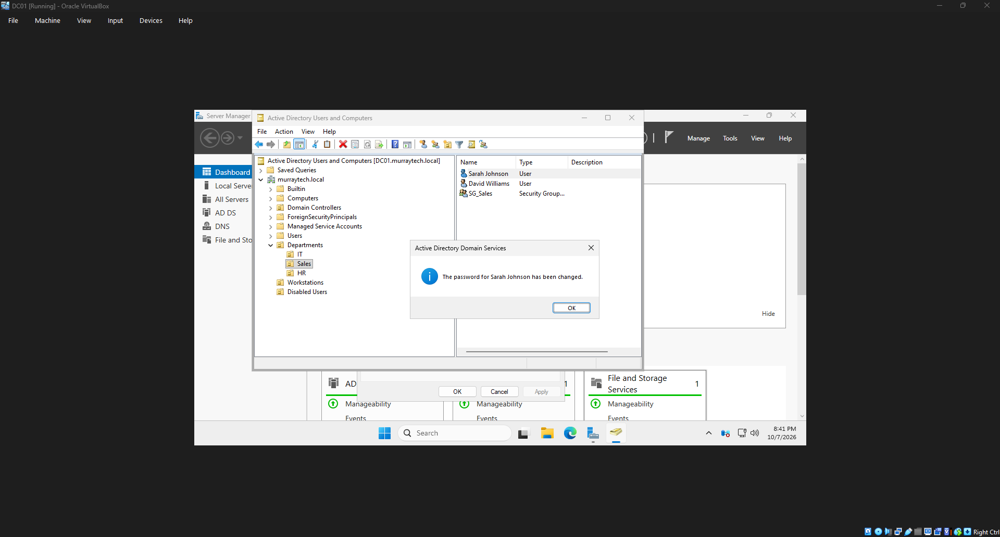
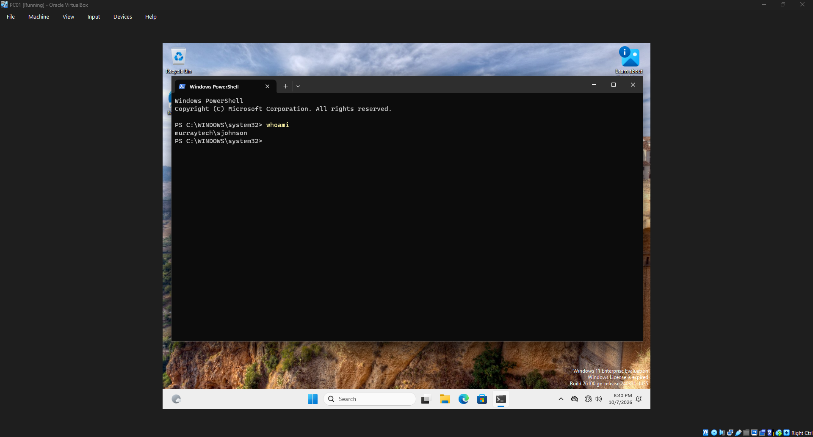

# HD-001 — Active Directory Password Reset

## Ticket Information

| Field | Details |
|---|---|
| Ticket ID | HD-001 |
| Category | Account Management |
| Priority | Medium |
| User | Sarah Johnson |
| Department | Sales |
| Status | Resolved |
| Environment | Windows Server 2025 / Windows 11 |

## Issue Description

A Sales employee reported being unable to access their workstation because they forgot their account password.

The objective was to reset the password in Active Directory and verify that the employee could successfully sign in.

## Troubleshooting and Resolution

1. Opened Active Directory Users and Computers on DC01.
2. Navigated to the Sales organizational unit.
3. Located Sarah Johnson's account.
4. Reset the account password and assigned a temporary password.
5. Enabled "User must change password at next logon."
6. Tested the account on the domain-joined Windows 11 workstation, PC01.
7. Completed the required password change.
8. Verified successful authentication using PowerShell.

## Verification

Executed the following command on PC01:

```powershell
whoami
```

Expected and observed result:

```text
murraytech\sjohnson
```

The employee successfully authenticated after changing the temporary password.

## Resolution

**Status: Resolved**

The employee's password was reset, and domain authentication was successfully verified.

## Screenshots

### Password Reset Confirmation



### Successful Login Verification



## Skills Demonstrated

- Active Directory user administration
- Password reset procedures
- Domain authentication troubleshooting
- Windows PowerShell verification
- Help desk ticket documentation

---

*This ticket documents a simulated support scenario in a fictional company environment.*
