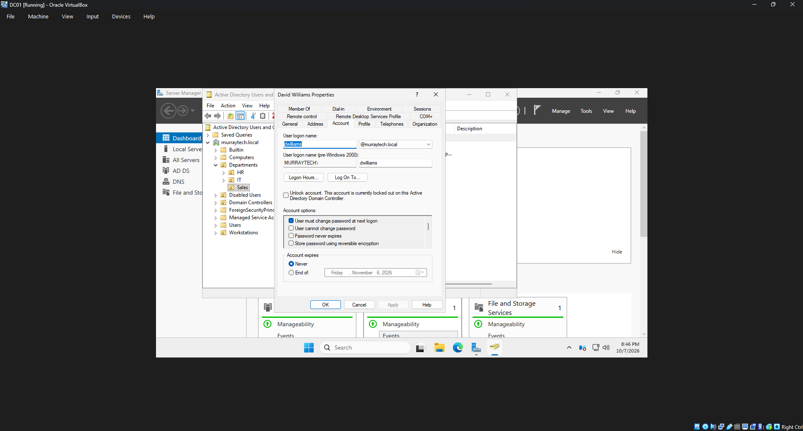
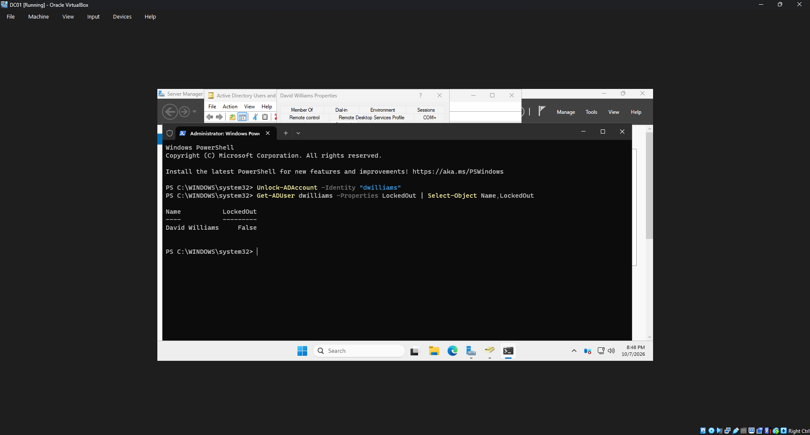
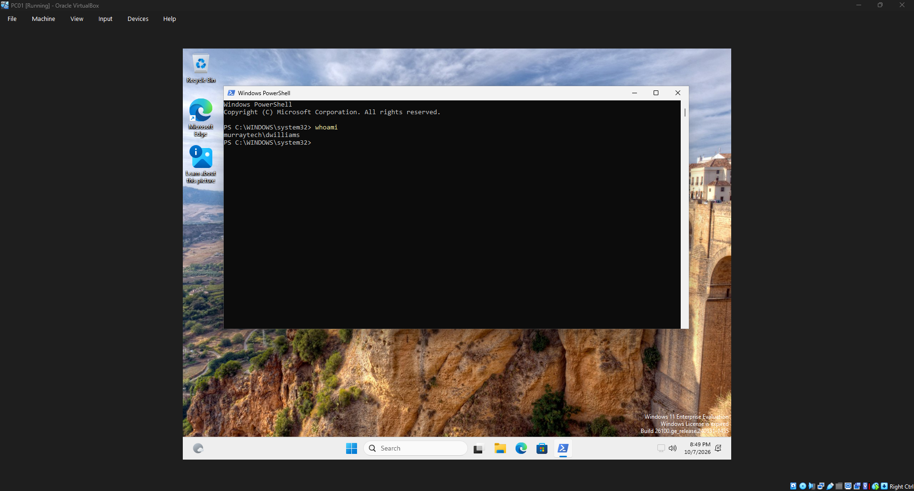

# HD-002 — Active Directory Account Lockout Troubleshooting

## Ticket Information

| Field | Details |
|---|---|
| Ticket ID | HD-002 |
| Category | Account Management / Authentication |
| Priority | Medium |
| User | David Williams |
| Department | Sales |
| Status | Resolved |
| Environment | Windows Server 2025 / Windows 11 |

## Issue Description

A Sales employee was unable to sign in to their workstation after entering an incorrect password multiple times. The account was locked out by the domain's security policy.

The goal was to identify the lockout, restore account access, and confirm that the employee could successfully authenticate.

## Troubleshooting and Resolution

1. Configured an Active Directory account lockout policy with a threshold of five failed sign-in attempts and a 15-minute lockout duration.
2. Attempted to sign in to the domain-joined Windows 11 workstation (PC01) using an incorrect password multiple times.
3. Confirmed that the account was locked.
4. Opened Active Directory Users and Computers on DC01.
5. Located David Williams's account in the Sales organizational unit.
6. Opened the account properties and unlocked the account.
7. Returned to PC01 and signed in using the correct credentials.
8. Confirmed that domain authentication was successful.

## Verification

The account lockout was reproduced successfully, and access was restored after unlocking the account in Active Directory.

The user was able to sign in to PC01 using their existing credentials.

## Resolution

**Status: Resolved**

The account was unlocked, and successful domain authentication was verified. No password reset was required.

## Screenshots

### Account Locked

### Account Unlocked

### Successful Login Verification

## Skills Demonstrated

- Active Directory account administration
- Account lockout policy configuration
- Authentication troubleshooting
- Windows domain account recovery
- Help desk ticket documentation

---

*This ticket documents a simulated support scenario in a fictional company environment.*
