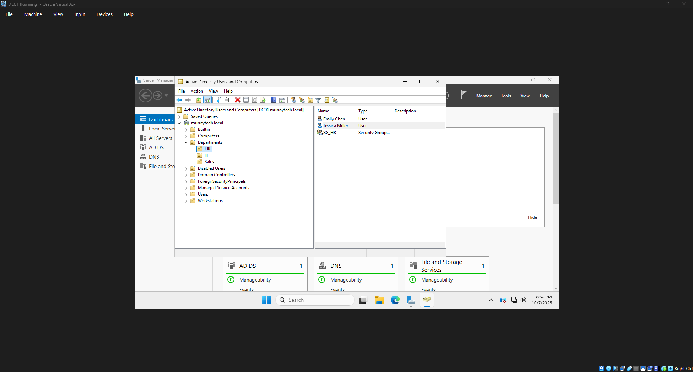
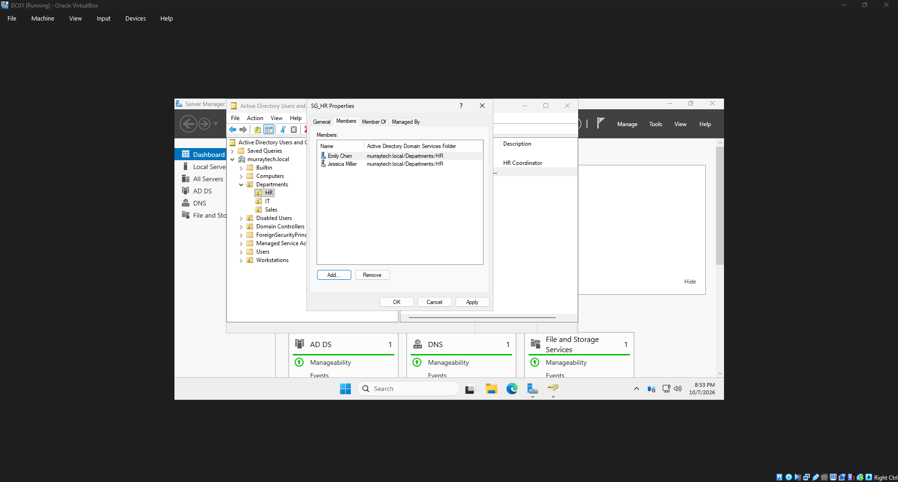
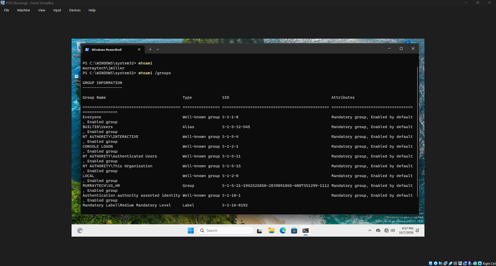

# HD-003 — New Employee Onboarding

## Ticket Information

| Field | Details |
|---|---|
| Ticket ID | HD-003 |
| Category | User Account Management |
| Priority | Medium |
| User | Jessica Miller |
| Department | Human Resources |
| Job Title | HR Coordinator |
| Status | Resolved |
| Environment | Windows Server 2025 / Windows 11 |

## Issue Description

A new employee, Jessica Miller, was joining the Human Resources department and needed an Active Directory account to access company resources.

The onboarding request required creating the employee's domain account, assigning the appropriate department security group, and verifying successful authentication on a domain-joined workstation.

## Troubleshooting and Resolution

1. Opened Active Directory Users and Computers on the domain controller (DC01).
2. Navigated to the Human Resources organizational unit.
3. Created a new user account for Jessica Miller.
4. Configured the account with the username `jmiller`.
5. Assigned an initial password and configured the account's password settings.
6. Added Jessica Miller to the `SG_HR` security group to provide department-based access.
7. Verified that the account appeared in the correct organizational unit.
8. Signed in to the Windows 11 workstation (PC01) using the new domain account.
9. Confirmed successful authentication.

## Verification

Successfully authenticated to the domain-joined workstation using Jessica Miller's account.

Verified that the account belonged to the appropriate HR security group and could be used for domain authentication.

## Resolution

**Status: Resolved**

The new employee's Active Directory account was created, assigned to the appropriate department security group, and successfully tested.

## Screenshots

### New User Account Created

### HR Security Group Membership

### Successful Login Verification

## Skills Demonstrated

- Active Directory user provisioning
- Employee onboarding procedures
- Organizational unit management
- Security group administration
- Role-based access control
- Windows domain authentication
- Help desk ticket documentation

---

*This ticket documents a simulated support scenario in a fictional company environment.*
