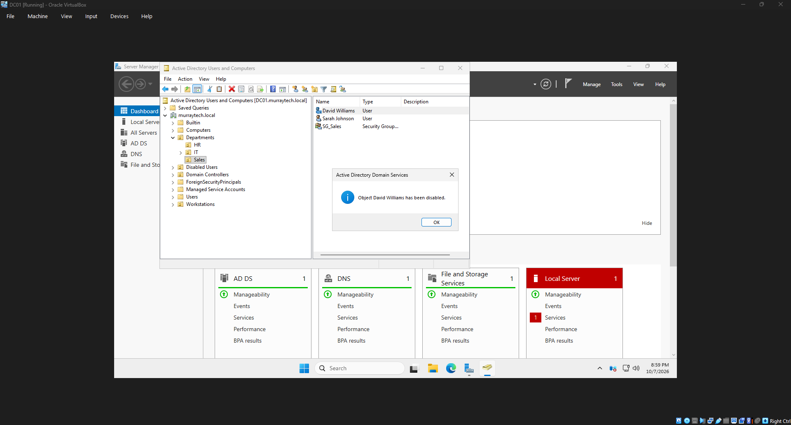
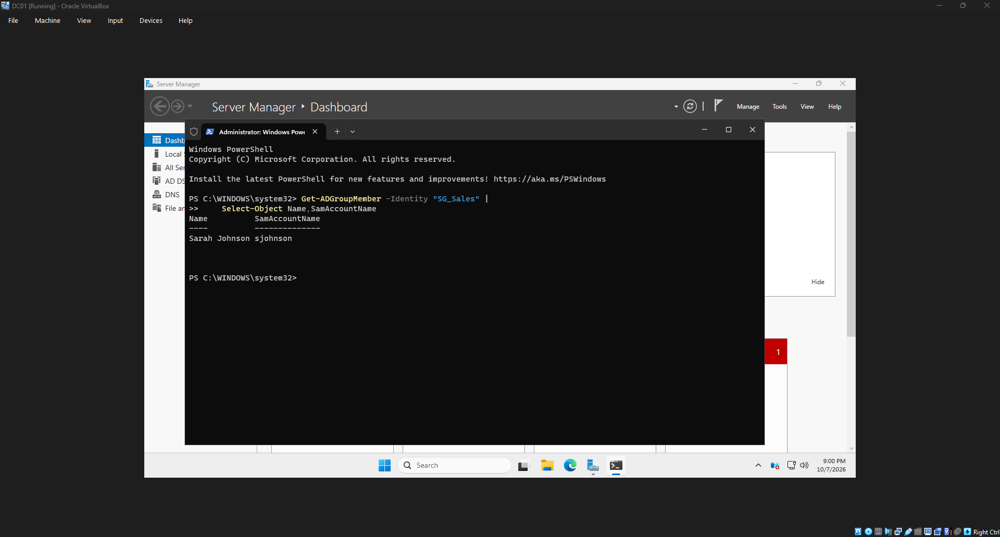
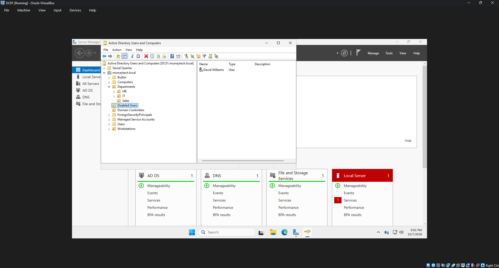
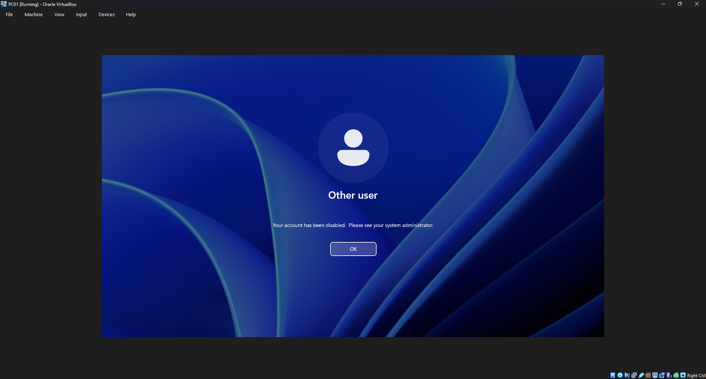

# HD-004 — Employee Offboarding

## Ticket Information

| Field | Details |
|---|---|
| Ticket ID | HD-004 |
| Category | Account Management / Access Removal |
| Priority | High |
| User | David Williams |
| Department | Sales |
| Status | Resolved |
| Environment | Windows Server 2025 / Windows 11 |

## Issue Description

The Human Resources department submitted a request to remove system access for David Williams, a Sales employee who was leaving the company.

The objective was to disable the employee's Active Directory account, remove department-specific access, and verify that the former employee could no longer authenticate to the domain.

## Troubleshooting and Resolution

1. Opened Active Directory Users and Computers on the domain controller (DC01).
2. Navigated to the Sales organizational unit.
3. Located David Williams's account (`dwilliams`).
4. Disabled the Active Directory account to prevent further authentication.
5. Opened the account's group membership settings.
6. Removed the account from the `SG_Sales` security group.
7. Moved the disabled account to the `Disabled Users` organizational unit.
8. Attempted to sign in to the domain-joined Windows 11 workstation (PC01) using the disabled account.
9. Confirmed that domain authentication was denied.

## Verification

Verified that the account was disabled in Active Directory and no longer belonged to the Sales security group.

Confirmed that the account was moved to the Disabled Users organizational unit.

An attempted sign-in using the disabled account was unsuccessful, demonstrating that the account no longer had access to the domain.

## Resolution

**Status: Resolved**

The employee's Active Directory account was disabled, department security group membership was removed, and access was successfully revoked.

## Screenshots

### Account Disabled

### Security Group Membership Removed

### Account Moved to Disabled Users OU

### Login Denied

## Skills Demonstrated

- Active Directory account deactivation
- Employee offboarding procedures
- Security group membership management
- Organizational unit administration
- Access control and account security
- Domain authentication verification
- Help desk ticket documentation

---

*This ticket documents a simulated support scenario in a fictional company environment.*
